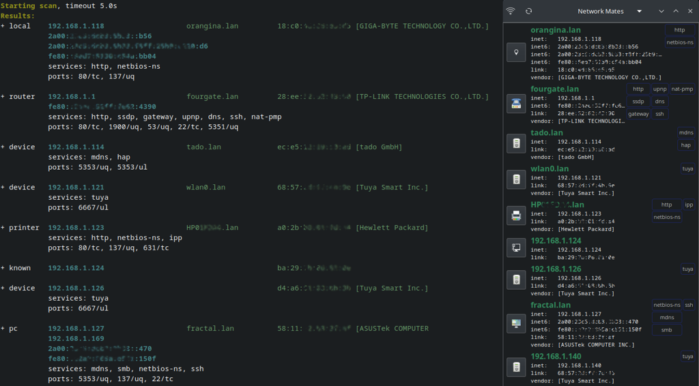

# Network Mates

Network discovery tool for local devices, combining multiple discovery methods.

Available as command-line and a simple gtk-based interface for Linux only.

## Discovery Methods

Several discovery methods are used:

- **OS known devices**: sourced from routing, arp and rtnetlink neighbour tables. Resolves MAC addresses against OUI database (if installed)
- **Port scanning**: for commonly known ports across the ipv4 subnet will attempt a TCP connect, which is not meant to be invasive or an advanced scan.
- **Broadcast listening**: listens on commonly known ports (and quietly skips already bound or low port numbers unavailable for listening)
- **SSDP**: sends out a service discovery message and listens for ongoing notifications (if port 1900 is available)
- **MDNS**: sends out a service discovery requesting unicast responses, but also listening for multicast responses (if port 5353 is available)
- **LSD**: listening for notification of BitTorrent info hash
- Other common devices

For ipv6 neighbour discovery, there is no explicit solicitation of responses through ping or RA to avoid requiring a privileged NET_RAW operation. And also avoid calling an external application like ping. Instead, you can solicit all nodes through a basic ping to the all-node multicast address:

        $ ping ff02::1

Hosts who reply will then show up in `netmates` or through `ip neighbour`

## Installing

Use one of the packages in the *Releases* section. Packaging typically produces `.deb`, `.rpm` and `.tgz` files

## Building

If you prefer not to install the packaged release files, you can easily build on most common distributions

#### Dependencies:

These packages are required to build and run. They should be available on most distributions without additional installation. Specifically here are the corresponding Debian packages.

- libc
- glib-2 (usual package libglib2.0.0 and source libglib2.0-dev)
- gtk-3 (optional to compile GUI target, package libgtk-3 and source libgtk-3-dev)

Additionally, in order to resolve MAC address to their vendor names:

- ieee-data (provides oui.csv, or run `sudo update-ieee-data` if it's outdated. On distributions that don't have it, like Fedora, you can download the file directly to your .config directory with something like `wget https://standards.ieee.org/develop/regauth/oui/oui.csv -O ~/.config/ieee-oui.csv`)

#### Compiling

If the gtk-3 headers are detected through pkgconfig, the gui will be built too.

        cmake -B build
        cmake --build build

        sudo cmake --install build

Alternatively, add `--prefix /usr` or run it directly from build/ directory

## Documentation

After installing, `man netmates`. Or from source you can read it with `man doc/netmates.1`

## Issues

Open to details on more common services and devices, see the scan.c file for definition of which ports scanned and listened for.

## To do

Potential future improvements

- Additional information
    - mdns: parse device-info TXT record for device model
    - process connect responses: nat-pmp public address, parse nbs scan for hostname
- Scan only required ports and report on actual ports to be scanned (filter defined ports)
    - Filter probes by method or service
- Classify hosts based on several services together at the end
    - Classify hosts by connect_ports open and SSDP/mDNS replies
    - Port combinations: 6667 broadcast and 6668/tcp open -> tuya
    - narrow down Alexa/iPhone
    - HW vendor to set host_type?
- avoid mixing C types and switch to standard?

# Copyright

Copyright 2025, Ahmad Khalifa
Licensed under the GPLv3

Includes:
- log.c, Copyright 2020 rxi
- munit, Copyright 2013-2018 Evan Nemerson
